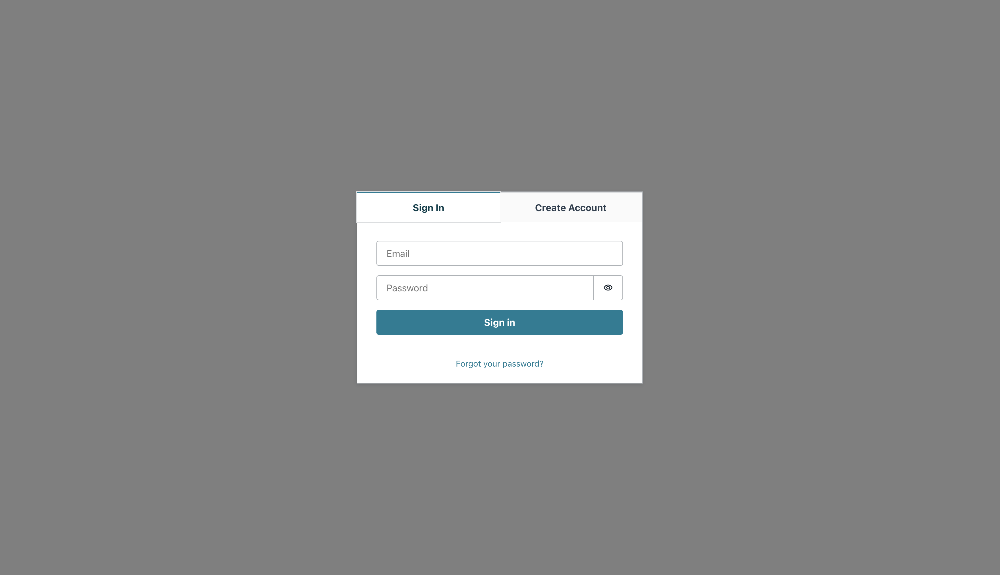

# Amazon Cognito Workshops

## Tasks

### 1. Create a user pool


### 2. Add token validation to an API

Update `server/config.js`

```js
export default {
  userPoolId: "<user_pool_id>",
  clientId: "<client_id>",
};
```

Add `preHandler` that will validate received token

```js
import { CognitoJwtVerifier } from 'aws-jwt-verify';

const verifier = CognitoJwtVerifier.create({
    userPoolId: config.userPoolId,
    clientId: config.clientId,
    tokenUse: 'access',
});

// in fastify.route
preHandler: async (request, reply) => {
    const header = request.headers.authorization;
    const accessToken = header.split('Bearer ')[1];
    try {
        const payload = await verifier.verify(accessToken);
    } catch {
        reply.status(401).send('Unauthorized')
    }
},
```

```bash
curl -H "Authorization: Bearer <access_token>" http://localhost:5000/
```

### 3. Use Hosted UI to authenticate your users


Update `client/hosted-ui/config.js`

```js
export default {
  SIGN_IN_SCREEN_URL: "<your_hosted_ui_url_for_the_app>",
  API_URL: "http://localhost:5000",
  ACCESS_TOKEN_STORAGE_KEY: "accessToken",
};
```

Update `client/hosted-ui/api.js`

```js
export const fetchData = async () => {
  const accessToken =
    localStorage.getItem(config.ACCESS_TOKEN_STORAGE_KEY) || "";
  const response = await fetch(config.API_URL, {
    headers: {
      Authorization: `Bearer ${accessToken}`,
    },
  });
  if (response.status === 401) {
    window.location.href = config.SIGN_IN_SCREEN_URL;
  }

  return response.json();
};
```

Update `client/hosted-ui/src/pages/OAuthRedirect.jsx`

```js
function OAuthRedirect() {
  useEffect(() => {
    if (window.location.hash === "") {
      window.location.href = "/";
    }
    const accessToken = window.location.href
      .split("access_token=")[1]
      .split("&")[0];
    localStorage.setItem(config.ACCESS_TOKEN_STORAGE_KEY, accessToken);
    window.location.href = "/";
  }, []);

  return null;
}
```

### 4. Use Amplify UI React components in your app



Update `client/amplify-ui/src/config.js`;

```js
export default {
  REGION: "XX-XXXX-X",
  USER_POOL_ID: "XX-XXXX-X_abcd1234",
  USER_POOL_WEB_CLIENT_ID: "a1b2c3d4e5f6g7h8i9j0k1l2m3",
  API_URL: "http://localhost:5000",
};
```

Update `client/amplify-ui/src/api.js`

```js
export const fetchData = async () => {
  const cognitoLastAuthUser = localStorage.getItem(
    `CognitoIdentityServiceProvider.${config.USER_POOL_WEB_CLIENT_ID}.LastAuthUser`
  );
  const accessTokenStorageKey = `CognitoIdentityServiceProvider.${config.USER_POOL_WEB_CLIENT_ID}.${cognitoLastAuthUser}.accessToken`;
  const accessToken = localStorage.getItem(accessTokenStorageKey) || "";
  const response = await fetch(config.API_URL, {
    headers: {
      Authorization: `Bearer ${accessToken}`,
    },
  });

  return response.json();
};
```

Update `client/amplify-ui/src/App.jsx`

```js
import { Amplify } from "aws-amplify";
import { withAuthenticator } from "@aws-amplify/ui-react";
import "@aws-amplify/ui-react/styles.css";

import config from "./config";

Amplify.configure({
  region: config.REGION,
  userPoolId: config.USER_POOL_ID,
  userPoolWebClientId: config.USER_POOL_WEB_CLIENT_ID,
});

export default withAuthenticator(App, { loginMechanisms: ["email"] });
```

### 5. Use custom UI (MUI template) for sign in


Update `client/custom-ui/src/config.js`

```js
export default {
  REGION: "XX-XXXX-X",
  USER_POOL_ID: "XX-XXXX-X_abcd1234",
  USER_POOL_WEB_CLIENT_ID: "a1b2c3d4e5f6g7h8i9j0k1l2m3",
  API_URL: "http://localhost:5000",
};
```

Update `client/custom-ui/src/api.js`

```js
export const fetchData = async () => {
  const cognitoLastAuthUser = localStorage.getItem(
    `CognitoIdentityServiceProvider.${config.USER_POOL_WEB_CLIENT_ID}.LastAuthUser`
  );
  const accessTokenStorageKey = `CognitoIdentityServiceProvider.${config.USER_POOL_WEB_CLIENT_ID}.${cognitoLastAuthUser}.accessToken`;
  const accessToken = localStorage.getItem(accessTokenStorageKey) || "";
  const response = await fetch(config.API_URL, {
    headers: {
      Authorization: `Bearer ${accessToken}`,
    },
  });

  return response.json();
};
```

Update `client/custom-ui/src/context/auth-context.jsx`

```js
import {
  AuthenticationDetails,
  CognitoUserPool,
  CognitoUser,
} from "amazon-cognito-identity-js";
import * as AWS from "aws-sdk/global";

import config from "../config";

AWS.config.region = config.REGION;

const signIn = ({ email, password }) => {
  const authenticationDetails = new AuthenticationDetails({
    Username: email,
    Password: password,
  });

  const userPool = new CognitoUserPool({
    UserPoolId: config.USER_POOL_ID,
    ClientId: config.USER_POOL_WEB_CLIENT_ID,
  });

  const cognitoUser = new CognitoUser({ Username: email, Pool: userPool });

  cognitoUser.authenticateUser(authenticationDetails, {
    onSuccess: (result) => {
      setUser(result);
    },
    onFailure: (err) => {
      console.error(err);
    },
  });
};
```

## Pros and cons

### Pros

- [pricing](https://aws.amazon.com/cognito/pricing/)
- customizable auth flow (with AWS Lambda) e.g. [passwordless email authentication](https://aws.amazon.com/blogs/mobile/implementing-passwordless-email-authentication-with-amazon-cognito/)
- integrations with other AWS Services e.g.:
  - temporary AWS credentials to use with SDK ([Identity Pool](https://docs.aws.amazon.com/cognito/latest/developerguide/getting-started-with-identity-pools.html))
  - access control for your API in [Amazon API Gateway](https://docs.aws.amazon.com/apigateway/latest/developerguide/apigateway-integrate-with-cognito.html).

### Cons

- can't change some settings once a user pool is created
- very limited ability to customize hosted UI ([docs](https://docs.aws.amazon.com/cognito/latest/developerguide/cognito-user-pools-app-ui-customization.html)) e.g can't set an image as a background for the page
- social sign-on goes through a user pool's hosted UI [docs](https://docs.aws.amazon.com/cognito/latest/developerguide/cognito-user-pools-social-idp.html)
- available packages' API
- a known issue with accounts linking, described [here](https://bobbyhadz.com/blog/aws-cognito-amplify-bad-bugged#oauth-registration-with-amplify)

## Resources

- [AWS Cognito Develper Guide - Create a user pool](https://docs.aws.amazon.com/cognito/latest/developerguide/cognito-user-pool-as-user-directory.html)

- [AWS Cognito Develper Guide - Add an app to enable the hosted web UI](https://docs.aws.amazon.com/cognito/latest/developerguide/cognito-user-pools-configuring-app-integration.html)

- [Cognito example redirect URL](http://localhost:3000/cb#access_token=eyJraWQiOiJLSm55clBKSllSTDNla2tWVDBaNFwvOXZlM0U1eTV6U0JQVExOSG5aVE1VND0iLCJhbGciOiJSUzI1NiJ9.eyJzdWIiOiJjNjk4ODQyYy1hNzE4LTQ1OWUtYTI0Mi1iM2UyYzZiODBjYTQiLCJ0b2tlbl91c2UiOiJhY2Nlc3MiLCJzY29wZSI6InBob25lIG9wZW5pZCBlbWFpbCIsImF1dGhfdGltZSI6MTY1MTY5NDg3OSwiaXNzIjoiaHR0cHM6XC9cL2NvZ25pdG8taWRwLmV1LWNlbnRyYWwtMS5hbWF6b25hd3MuY29tXC9ldS1jZW50cmFsLTFfcTlQU0h3ajBtIiwiZXhwIjoxNjUxNjk4NDc5LCJpYXQiOjE2NTE2OTQ4NzksInZlcnNpb24iOjIsImp0aSI6IjljZTMwZGFhLTdlMTAtNDhmMC05Y2EwLWI1YTJiOWY1NzhiNyIsImNsaWVudF9pZCI6IjF2ZWN1aW9iOTI5MzZhbmtlb3E4czJ1cmprIiwidXNlcm5hbWUiOiJjNjk4ODQyYy1hNzE4LTQ1OWUtYTI0Mi1iM2UyYzZiODBjYTQifQ.JiwI3jlBblm4xYlhFh8NUw1EbGNuiku3yD63Bgk1kRwaikx-vKF2wCKoYxqEM7Z99U4eu1_98Nqefh6Us4aYyDFQZl1m91mBSZpfm6o5iDbHVc6ciO3ak88jfLmxHnb42NX8tmf3vxHdT_YW7e2eakVJeP3AsUgt6xG_zHxEH8rQNuu9wZ5OR8U5EI_E18PfwP8hR8RoagJED9hP60LrbzaPFnPWMcPdDPQG4zKhoT2GbEtnyy6OTAt7Y2LfZwoJ7BA4_pIcyRA6e3Qp8ly7OhVCGMf5EO1-FWfHdt9BRKAvt164tO_dtszwpUauaTbCTVhXlXrBFJYXteUZLXclgg&id_token=eyJraWQiOiJYd1o2aUpObFI3RFdDc1QxVGtscFRha1lLMzhSVHUzZmNtYUxSQ2xQc2VjPSIsImFsZyI6IlJTMjU2In0.eyJhdF9oYXNoIjoiUzFMRkIxd3RuYVFDWlFzNkJvVER5dyIsInN1YiI6ImM2OTg4NDJjLWE3MTgtNDU5ZS1hMjQyLWIzZTJjNmI4MGNhNCIsImVtYWlsX3ZlcmlmaWVkIjp0cnVlLCJpc3MiOiJodHRwczpcL1wvY29nbml0by1pZHAuZXUtY2VudHJhbC0xLmFtYXpvbmF3cy5jb21cL2V1LWNlbnRyYWwtMV9xOVBTSHdqMG0iLCJjb2duaXRvOnVzZXJuYW1lIjoiYzY5ODg0MmMtYTcxOC00NTllLWEyNDItYjNlMmM2YjgwY2E0IiwiYXVkIjoiMXZlY3Vpb2I5MjkzNmFua2VvcThzMnVyamsiLCJ0b2tlbl91c2UiOiJpZCIsImF1dGhfdGltZSI6MTY1MTY5NDg3OSwiZXhwIjoxNjUxNjk4NDc5LCJpYXQiOjE2NTE2OTQ4NzksImp0aSI6IjI4NzA5MmQ5LTMxYWEtNDZhZC1iMTg1LTBmZGExNDI5OWQ0YiIsImVtYWlsIjoiYW5uYS5sYWNoQGJyYWluaHViLnBsIn0.HhPYDrWL9bw9YiEn8pnisesg_4EbWgWAtzTHShHZultNFeSdAnpKYjgijLS6CzhDTHwKGXDgAV7gNXKPmp-tagvyMpoD7EJ5t2i7s_AvPjtqK3ictj5foqZVM-zyg9kk7l9r5WlwmpcboXdFP0Ab-HsK04zWMAg_UkmG3C2RxhV8sT5SKYVeLQpRGUyKxlqP8SYKk7Y9JSTfbbxzVkeoU51KvIQyrdPT5Wt3iD7tFmkkX3LMZzKAZZ8Ztk8n-rqI4gY0c6CYxg0ZiRbkHy7_U_m5P90veiCXVq1fzG61AKGiQaWyfzx-Bg4cSi_wBoOCr8aNHY9q6pMVcMcSlcElDg&token_type=Bearer&expires_in=3600)

- [Example Access Token](https://jwt.io/#debugger-io?token=eyJraWQiOiJLSm55clBKSllSTDNla2tWVDBaNFwvOXZlM0U1eTV6U0JQVExOSG5aVE1VND0iLCJhbGciOiJSUzI1NiJ9.eyJzdWIiOiJjNjk4ODQyYy1hNzE4LTQ1OWUtYTI0Mi1iM2UyYzZiODBjYTQiLCJ0b2tlbl91c2UiOiJhY2Nlc3MiLCJzY29wZSI6InBob25lIG9wZW5pZCBlbWFpbCIsImF1dGhfdGltZSI6MTY1MTY5NDg3OSwiaXNzIjoiaHR0cHM6XC9cL2NvZ25pdG8taWRwLmV1LWNlbnRyYWwtMS5hbWF6b25hd3MuY29tXC9ldS1jZW50cmFsLTFfcTlQU0h3ajBtIiwiZXhwIjoxNjUxNjk4NDc5LCJpYXQiOjE2NTE2OTQ4NzksInZlcnNpb24iOjIsImp0aSI6IjljZTMwZGFhLTdlMTAtNDhmMC05Y2EwLWI1YTJiOWY1NzhiNyIsImNsaWVudF9pZCI6IjF2ZWN1aW9iOTI5MzZhbmtlb3E4czJ1cmprIiwidXNlcm5hbWUiOiJjNjk4ODQyYy1hNzE4LTQ1OWUtYTI0Mi1iM2UyYzZiODBjYTQifQ.JiwI3jlBblm4xYlhFh8NUw1EbGNuiku3yD63Bgk1kRwaikx-vKF2wCKoYxqEM7Z99U4eu1_98Nqefh6Us4aYyDFQZl1m91mBSZpfm6o5iDbHVc6ciO3ak88jfLmxHnb42NX8tmf3vxHdT_YW7e2eakVJeP3AsUgt6xG_zHxEH8rQNuu9wZ5OR8U5EI_E18PfwP8hR8RoagJED9hP60LrbzaPFnPWMcPdDPQG4zKhoT2GbEtnyy6OTAt7Y2LfZwoJ7BA4_pIcyRA6e3Qp8ly7OhVCGMf5EO1-FWfHdt9BRKAvt164tO_dtszwpUauaTbCTVhXlXrBFJYXteUZLXclgg&publicKey=%7B%0A%20%20%22e%22%3A%20%22AQAB%22%2C%0A%20%20%22kty%22%3A%20%22RSA%22%2C%0A%20%20%22n%22%3A%20%22vOAmxY5hQGD8zR97u12zB9BW5zb5sW_pA7qDl-isNkk9QcTOwW0jBKjGHOIqjMcvrUhIf6hCRF-YdkFXRWmTJrasEsETvLtXxt6rXUcG71-iLPLF8JZDbAihCLShag4wCihvYrQqgxle2ZZs73bfNwdoD0VYF6Lb8_8AEEFQ5cAP9pMnfSadz0s5CWoQNgHBXOBNGCD88PRPoQMrZOV1TFlphGGtBkIaMyXxTUPQBw82f--ql1-6Sw7_9eUcQ-RVW6ybq2mDGc7yKvWwIB9OQUy55uH4ZKIN6OksdgeBPy4cBHSAFnFgdM1ORMLzhOkOVHW1SOLiW5aHwfuTSn2Fjw%22%0A%7D)

- [Example ID Token](https://jwt.io/#debugger-io?token=eyJraWQiOiJYd1o2aUpObFI3RFdDc1QxVGtscFRha1lLMzhSVHUzZmNtYUxSQ2xQc2VjPSIsImFsZyI6IlJTMjU2In0.eyJhdF9oYXNoIjoiUzFMRkIxd3RuYVFDWlFzNkJvVER5dyIsInN1YiI6ImM2OTg4NDJjLWE3MTgtNDU5ZS1hMjQyLWIzZTJjNmI4MGNhNCIsImVtYWlsX3ZlcmlmaWVkIjp0cnVlLCJpc3MiOiJodHRwczpcL1wvY29nbml0by1pZHAuZXUtY2VudHJhbC0xLmFtYXpvbmF3cy5jb21cL2V1LWNlbnRyYWwtMV9xOVBTSHdqMG0iLCJjb2duaXRvOnVzZXJuYW1lIjoiYzY5ODg0MmMtYTcxOC00NTllLWEyNDItYjNlMmM2YjgwY2E0IiwiYXVkIjoiMXZlY3Vpb2I5MjkzNmFua2VvcThzMnVyamsiLCJ0b2tlbl91c2UiOiJpZCIsImF1dGhfdGltZSI6MTY1MTY5NDg3OSwiZXhwIjoxNjUxNjk4NDc5LCJpYXQiOjE2NTE2OTQ4NzksImp0aSI6IjI4NzA5MmQ5LTMxYWEtNDZhZC1iMTg1LTBmZGExNDI5OWQ0YiIsImVtYWlsIjoiYW5uYS5sYWNoQGJyYWluaHViLnBsIn0.HhPYDrWL9bw9YiEn8pnisesg_4EbWgWAtzTHShHZultNFeSdAnpKYjgijLS6CzhDTHwKGXDgAV7gNXKPmp-tagvyMpoD7EJ5t2i7s_AvPjtqK3ictj5foqZVM-zyg9kk7l9r5WlwmpcboXdFP0Ab-HsK04zWMAg_UkmG3C2RxhV8sT5SKYVeLQpRGUyKxlqP8SYKk7Y9JSTfbbxzVkeoU51KvIQyrdPT5Wt3iD7tFmkkX3LMZzKAZZ8Ztk8n-rqI4gY0c6CYxg0ZiRbkHy7_U_m5P90veiCXVq1fzG61AKGiQaWyfzx-Bg4cSi_wBoOCr8aNHY9q6pMVcMcSlcElDg&publicKey=%7B%0A%20%20%22e%22%3A%20%22AQAB%22%2C%0A%20%20%22kty%22%3A%20%22RSA%22%2C%0A%20%20%22n%22%3A%20%22vEBHTCm6hH5aA9Zx-ogCsfcLUvb44uxw6517pNTVEXhBcQRgSSiLgV-iL_ByjUb5-rqAbQKoH3eNEflRCFd9MpucYOHZkxWfeyCLPN7F81Nv_kuHPamGzwlx8fLwxxm1j84pqN3_V3vJTRi_nqtaJPF-jch4QPJqUye4t5Nc3QqguPoRLRJ07h0e8968YckjnnXzbXdU1OQ9X-KKNN3nWuZLqIpf050sFwTZX9x7TzMTOrwcKBbbf9NQ_PYY5Ws0plyn-ymFTKL5zONL4O_7jnakof2NBd12c31jUkPn1OMTNdYfGPggUFocrhADLl4krH2ep6jU77Q-ykUao8zcKQ%22%0A%7D)

- [Amplify UI docs](https://ui.docs.amplify.aws/components/authenticator?platform=react)

- [MUI React Templates](https://mui.com/material-ui/getting-started/templates/)

- [Amazon Cognito Identity SDK for JavaScript](https://github.com/aws-amplify/amplify-js/tree/main/packages/amazon-cognito-identity-js)

- [Authentication in React Applications](https://kentcdodds.com/blog/authentication-in-react-applications)

- [An Illustrated Guide to OAuth and OpenID Connect](https://youtu.be/t18YB3xDfXI)
